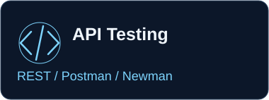
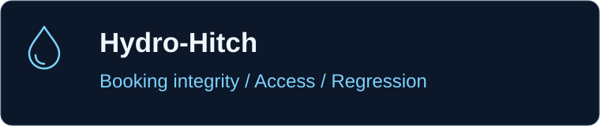

  

# M. Rehmatullah Wadi Wala

**Software QA & Business Analysis · Banking & FinTech** 
API Testing · SQL · Postman · Test Automation

My professional direction is quality engineering for financial technology: understanding requirements, testing business rules, and validating systems beyond the interface. My public portfolio connects API and database testing with automation, controlled workflows, and traceable evidence.

[Explore the projects](#flagship-projects) · [Review the evidence](#business-analysis-with-a-traceable-test-path) · [Connect on LinkedIn](https://www.linkedin.com/in/rehmatullahwadi/)

  
  
  

  
  
  
  
  

## Flagship projects

  
  
  
  

**Trade finance document verification, built around explainable quality controls.**

A synthetic documentary-credit demonstration connecting document evidence, business rules, independent approvals, and audit records. It shows how requirements become verifiable behavior across the API, database and user workflow.

- **QA relevance:** rule validation, role and ownership checks, maker-checker separation, workflow transitions, concurrency controls and audit integrity.
- **Testing:** Pytest unit, integration and security suites; Playwright browser journeys; Postman/Newman API assertions; SQL integrity probes.
- **Engineering:** Python / FastAPI, React / TypeScript, SQLAlchemy, PostgreSQL configuration, SQLite local demo, Docker and GitHub Actions.

[Requirements](https://github.com/rehmatwadii/accordflow/blob/main/docs/BRD.md) · [Traceability matrix](https://github.com/rehmatwadii/accordflow/blob/main/docs/RTM.md) · [Test strategy](https://github.com/rehmatwadii/accordflow/blob/main/docs/TEST_STRATEGY.md) · [Recorded test results](https://github.com/rehmatwadii/accordflow/blob/main/docs/TEST_RESULTS.md) · [Architecture](https://github.com/rehmatwadii/accordflow/blob/main/docs/ARCHITECTURE.md)

See the synthetic document-validation workbench

> Synthetic demonstration data only. No real bank deployment, customer transactions or regulatory certification is claimed. [Implementation boundaries](https://github.com/rehmatwadii/accordflow/blob/main/docs/IMPLEMENTATION_STATUS.md) and [production gaps](https://github.com/rehmatwadii/accordflow/blob/main/docs/PRODUCTION_GAP_ANALYSIS.md) are documented.

  
  
  
  

**Water-delivery workflows, tested for booking integrity and controlled access.**

A systems-focused retrofit spanning customers, drivers, dispatchers and administrators. Its strongest portfolio signal is the regression evidence around state transitions, server-owned pricing, authorization and concurrent bookings.

- **QA relevance:** duplicate-request protection, ownership isolation, slot capacity, booking lifecycle, pricing snapshots and database failure handling.
- **Testing:** Node.js test runner / Supertest API regression tests, MongoDB replica-set test fixtures, Playwright end-to-end journeys and axe accessibility checks.
- **Engineering:** JavaScript, React, Node.js / Express, MongoDB, Docker and GitHub Actions.

[API regression suite](https://github.com/rehmatwadii/Hydro-Hitch/blob/main/server/tests/api.test.js) · [Browser tests](https://github.com/rehmatwadii/Hydro-Hitch/tree/main/tests/e2e) · [Verification evidence](https://github.com/rehmatwadii/Hydro-Hitch/tree/main/docs/verification) · [Retrofit report & limitations](https://github.com/rehmatwadii/Hydro-Hitch/blob/main/docs/RETROFIT_REPORT.md) · [Before & after](https://github.com/rehmatwadii/Hydro-Hitch/tree/main/docs/comparison)

  
  
  
  

**An interactive SQA career simulator: investigate, reproduce, verify, and decide.**

A practical QA learning environment spanning three fictional products: ShopSphere commerce, FinEdge transfers, and RelayDesk expense approvals. Learners review requirements, design test cases, report reproducible defects, investigate APIs and data, repair automation, and make evidence-based release decisions.

- **QA relevance:** acceptance-criteria review, boundary testing, defect evidence, authorization risks, payment retries, regression design and release judgment.
- **Hands-on labs:** simulated HTTP requests, real read-only SQLite queries, constrained Playwright-style automation, pipeline repair, incident investigation and independent assessments.
- **Repository testing:** Vitest unit tests and real Playwright browser tests covering career progression, assessment submissions, save/reload and responsive workflows; GitHub Actions runs build, typecheck and test checks.
- **Engineering:** Next.js, React, TypeScript, Monaco Editor and browser-based SQLite (sql.js).

[Player guide](https://github.com/rehmatwadii/-qaforge/blob/main/docs/GAMEPLAY.md) | [Test suites](https://github.com/rehmatwadii/-qaforge/tree/main/tests) | [Screenshot gallery](https://github.com/rehmatwadii/-qaforge/blob/main/docs/SCREENSHOTS.md) | [Scope & limitations](https://github.com/rehmatwadii/-qaforge#current-scope)

See the QAForge career workstation

> Fictional training scenarios. In-game HTTP, Git, automation and load tools are constrained simulations; SQL runs on a real SQLite engine. Simulated career outcomes are not employment experience or professional certification.

## Quality Engineering Toolkit

| Discipline | Demonstrated in the portfolio |
| :--- | :--- |
| **Software Testing** | Functional and regression scenarios, test case design, negative paths, defect documentation |
| **API & Data** | REST APIs, JSON assertions, Postman / Newman, SQL integrity checks, database validation |
| **Test Automation** | Python / Pytest, Playwright, Vitest, Node.js test runner, Supertest |
| **Security Controls** | Authorization, ownership isolation, input validation, session and workflow regression tests |
| **Quality Workflow** | Git, GitHub, CI quality gates, test reports, documented verification limits |
| **Business Analysis** | Business and software requirements, acceptance criteria, business processes, traceability |

## Where quality engineering meets financial technology

I am focused on software where **data integrity, business rules, authorization, workflow controls and auditability** matter. AccordFlow makes that direction concrete through a synthetic Trade Finance workflow: inspect the evidence, explain a discrepancy, enforce independent approval, and preserve a traceable decision.

The goal is to develop QA Engineer capabilities for Banking and FinTech systems through public, reproducible work.

## Business analysis with a traceable test path

**System understanding → Requirements → Software testing → API & database validation → Automation → Quality Engineering → Banking / FinTech**

AccordFlow provides a direct path from business intent to test evidence:

[Business requirements](https://github.com/rehmatwadii/accordflow/blob/main/docs/BRD.md) → [Software requirements & acceptance criteria](https://github.com/rehmatwadii/accordflow/blob/main/docs/SRS.md) → [Requirements traceability](https://github.com/rehmatwadii/accordflow/blob/main/docs/RTM.md) → [Test cases](https://github.com/rehmatwadii/accordflow/blob/main/docs/TEST_CASES.md) → [Recorded results](https://github.com/rehmatwadii/accordflow/blob/main/docs/TEST_RESULTS.md)

## Supporting technical stack

| Layer | Technologies used in the featured repositories |
| :--- | :--- |
| Languages | Python · JavaScript · TypeScript · SQL |
| Frontend | React · Next.js · Vite |
| Backend | FastAPI · Node.js · Express |
| Data | PostgreSQL configuration · SQLite · MongoDB · SQLAlchemy |
| Testing | Vitest · Pytest · Playwright · Postman / Newman · Supertest · axe |
| Tools | Git · GitHub Actions · Docker · Alembic |

## Currently strengthening

Building on the demonstrated work: deeper API automation, SQL validation, Playwright and Pytest regression design, CI-driven testing, and Banking / FinTech quality engineering. These are continuing development priorities, rather than claims of expert-level experience.

## GitHub activity

The project badges above link to live CI status. The contribution animation below is generated from **rehmatwadii's** GitHub contribution graph; activity shows practice and delivery, while the linked tests and documentation show the quality evidence.

<picture>
  <source media="(prefers-color-scheme: dark)" srcset="https://raw.githubusercontent.com/rehmatwadii/rehmatwadii/output/github-contribution-grid-snake-dark.svg" />
  <source media="(prefers-color-scheme: light)" srcset="https://raw.githubusercontent.com/rehmatwadii/rehmatwadii/output/github-contribution-grid-snake.svg" />
  
</picture>

[View contribution history](https://github.com/rehmatwadii) · [Animation workflow](https://github.com/rehmatwadii/rehmatwadii/actions/workflows/snake.yml)

## Let's connect

Open to opportunities across **Software QA, Business Analysis, Banking Technology and FinTech**.

Email: [rehmatullahshahid@gmail.com](mailto:rehmatullahshahid@gmail.com)

---

*Building reliable software through quality, clarity and evidence.*
